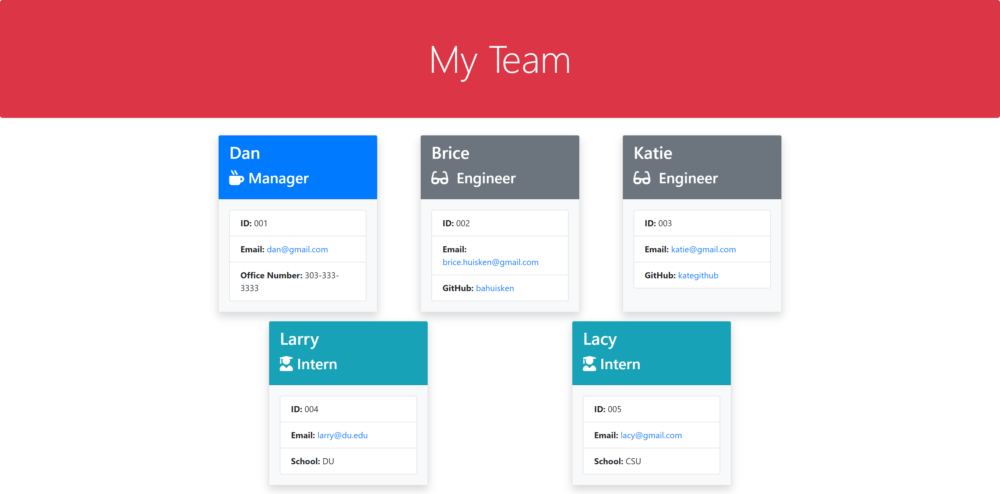

# Team-Profile-Generator

## Description

A Node.js command-line application using the [Inquirer package](https://www.npmjs.com/package/inquirer) that takes in information about employees on a software engineering team, then generates an HTML webpage that displays summaries for each person.

## Table of Contents

* [Installation](#installation)
* [Usage](#usage)
* [Credits](#credits)
* [License](#license)

## Installation

Download the files in this repository, open the directory where the files are saved in git bash / terminal, run the following:

```bash
node index.js
```

## Usage

Complete the prompts in the terminal. An HTML file will be generated based on the input. 

[Click here for a video walkthrough of this application](https://drive.google.com/file/d/1ffXpBk-CghKY-HgK6kylkuwnaelzOLwZ/view?usp=sharing)

[Here is a sample HTML created with this Generator](.dist/se-team.html)

Here is a screenshot of the generated HTML:




## Credits

* [bahuisken](https://github.com/bahuisken/)
* Lessons from University of Denver Fullstack Coding Bootcamp

## License

None

## Contributing

[Contributor Covenant](https://www.contributor-covenant.org/)

## Tests

See tests folder

## Questions

If you have any questions about the repo, open an issue or contact me directly at [brice.huisken@gmail.com](mailto:brice.huisken@gmail.com). You can find more of my work at [bahuisken](https://github.com/bahuisken/)